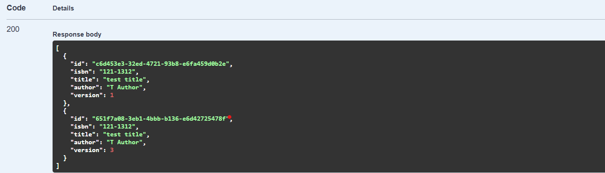

# Library Management System

A robust RESTful API system for managing library operations, built with Spring Boot and designed for scalability and containerization.

## Table of Contents
- [Features](#features)
- [Technology Stack](#technology-stack)
- [System Requirements](#system-requirements)
- [Database Configuration](#database-configuration)
- [Getting Started](#getting-started)
- [API Endpoints](#api-endpoints)
- [Development vs Production](#development-vs-production)
- [Docker Deployment](#docker-deployment)
- [Kubernetes Deployment](#kubernetes-deployment)
- [Monitoring and Health Checks](#monitoring-and-health-checks)

## Features
- Borrower registration and management
- Book inventory management
- Book borrowing and return tracking
- ISBN-based book identification
- Multiple copy support for books
- Concurrent access control for book borrowing
- Health monitoring and metrics

## Technology Stack
- Java 17
- Spring Boot 3.2.x
- Spring Data JPA
- Spring Boot Actuator
- H2 Database (Development)
- PostgreSQL (Production)
- Docker
- Kubernetes
- Maven

## System Requirements
- JDK 17 or higher
- Maven 3.6 or higher
- Docker 20.10 or higher (for containerization)
- Kubernetes 1.24 or higher (for orchestration)
- PostgreSQL 14 or higher (for production)

## Database Configuration

### Development (H2)
H2 is used in development for several reasons:
- In-memory database requiring no external setup
- Automatic schema creation and data initialization
- Easy to reset and modify during development
- Embedded console for database inspection

### Production (PostgreSQL)
PostgreSQL is recommended for production due to:
- Robust ACID compliance
- Excellent performance with large datasets
- Rich feature set including JSON support
- Strong concurrent access handling
- Proven reliability in production environments
- Better security features
- Data persistence and backup capabilities

## Getting Started

### Local Development Setup
1. Clone the repository:
   ```bash
   git clone https://github.com/bzaman18/bzlibrary.git
   cd bzlibrary
   ```

2. Build the project:
   ```bash
   ./mvnw clean install
   ```

3. Run the application:
   ```bash
   ./mvnw spring-boot:run
   ```

The application will start on `http://localhost:8080`

## API Endpoints

All endpoints are prefixed with `/api/v1/library` and support CORS (Cross-Origin Resource Sharing).

### Book Management
```
POST /api/v1/library/books
Register a new book
Request body: {
    "isbn": "978-0-7475-3269-9",
    "title": "Harry Potter",
    "author": "J.K. Rowling"
}
Response: 200 OK
- Returns the registered book details
Error responses:
- 400: Invalid book data provided

GET /api/v1/library/books
Retrieve all books in the library system
Response: 200 OK
- Returns a list of all books

GET /api/v1/library/books/inventory
Retrieves an inventory of all books grouped by isbn,together with number of copies of each book
Response: 200 OK
- Returns a list of all books
```

### Borrower Management
```
POST /api/v1/library/borrowers
Register a new borrower
Request body: {
    "name": "John Doe",
    "email": "john.doe@example.com"
}
Response: 200 OK
- Returns the registered borrower details
Error responses:
- 400: Invalid borrower data or email already exists
```

### Borrowing Operations
```
POST /api/v1/library/books/{bookId}/borrow/{borrowerId}
Borrow a book
Path variables:
- bookId: UUID of the book
- borrowerId: UUID of the borrower
Response: 200 OK
- Returns the loan record details
Error responses:
- 404: Book or borrower not found
- 400: Book is already borrowed

POST /api/v1/library/books/{bookId}/return
Return a borrowed book
Path variables:
- bookId: UUID of the book
Response: 200 OK
- Returns the updated loan record
Error responses:
- 404: No active loan found for this book
```

### Same Title/Author/ISBN Book allowed


### Request/Response Models

#### BookDto
```json
{
    "id": "UUID",
    "isbn": "string",
    "title": "string",
    "author": "string"
}
```

#### BorrowerDto
```json
{
    "id": "UUID",
    "name": "string",
    "email": "string"
}
```

#### LoanRecord
```json
{
    "id": "UUID",
    "bookId": "UUID",
    "borrowerId": "UUID",
    "borrowedAt": "datetime",
    "returnedAt": "datetime"
}
```


## Development vs Production

### Development Environment
```yaml
spring:
  datasource:
    url: jdbc:h2:mem:librarydb
    driver-class-name: org.h2.Driver
  jpa:
    database-platform: org.hibernate.dialect.H2Dialect
```

### Production Environment
```yaml
spring:
  datasource:
    url: jdbc:postgresql://localhost:5432/librarydb
    driver-class-name: org.postgresql.Driver
  jpa:
    database-platform: org.hibernate.dialect.PostgreSQLDialect
```

## Docker Deployment

1. Build the Docker image:
   ```bash
   docker build -t bzlibrary:latest .
   ```

2. Run with Docker Compose:
   ```bash
   docker-compose up -d
   ```

The application will be available at `http://localhost:8080`

## Kubernetes Deployment

1. Apply configuration files:
   ```bash
   kubectl apply -f k8s/namespace.yaml
   kubectl apply -f k8s/config-map.yaml
   kubectl apply -f k8s/secret.yaml
   kubectl apply -f k8s/postgres-deployment.yaml
   kubectl apply -f k8s/postgres-service.yaml
   kubectl apply -f k8s/app-deployment.yaml
   kubectl apply -f k8s/app-service.yaml
   ```

2. Verify deployment:
   ```bash
   kubectl get pods -n bzlibrary
   kubectl get services -n bzlibrary
   ```

## Monitoring and Health Checks

Health and metrics endpoints:
- Health: `http://localhost:8080/actuator/health`
- Metrics: `http://localhost:8080/actuator/metrics`
- Info: `http://localhost:8080/actuator/info`

### Health Check Configuration
```yaml
management:
  endpoints:
    web:
      exposure:
        include: health,metrics,info
  endpoint:
    health:
      show-details: always
```

## Security Considerations

For production following are recommended:

- All endpoints require authentication in production(OAuth, JWT)
- HTTPS is enforced in production
- Database credentials are managed through Kubernetes secrets
- Regular security updates should be applied

###  Authentication
- Implement **JWT-based authentication** for stateless and scalable authentication.
- Use a centralized authentication provider like **Keycloak/RedHat SSO** or **Auth0** to handle user logins, generate tokens, and manage roles and permissions.
- For custom authentication, use Spring Security to validate JWTs and manage user roles in the application.

### Authorization
- Adopt **Role-Based Access Control (RBAC)** for simple role management or **Attribute-Based Access Control (ABAC)** for more granular permissions.
- Embed roles and permissions as claims within the JWTs issued by the authentication server.
- Use Spring Security to dynamically validate roles and permissions during API requests.

### Observability
- Integrate **Spring Actuator** to monitor authentication and authorization endpoints.
- Implement custom security measures to ensure sensitive metrics and logs are only accessible by authorized users.
- Use monitoring tools like **Prometheus**, **Grafana**, and **ELK Stack** to track authentication and authorization metrics.

### Token Best Practices
- Use short-lived JWTs and implement refresh tokens to minimize the impact of token leakage.
- Rotate signing keys periodically and enforce strict expiration policies for enhanced security.
- Avoid storing sensitive user information in JWT payloads to prevent unintended data exposure.

### Scalability
- Deploy an **API Gateway** (e.g., Spring Cloud Gateway) to centralize authentication and request routing.
- Ensure all microservices are stateless by validating JWTs in each service independently.
- Implement caching strategies for token validation to reduce latency and improve performance.


### Other Enhancements
- Rate Limiting
- Fine calculation for late returns
- Book categories and search functionality